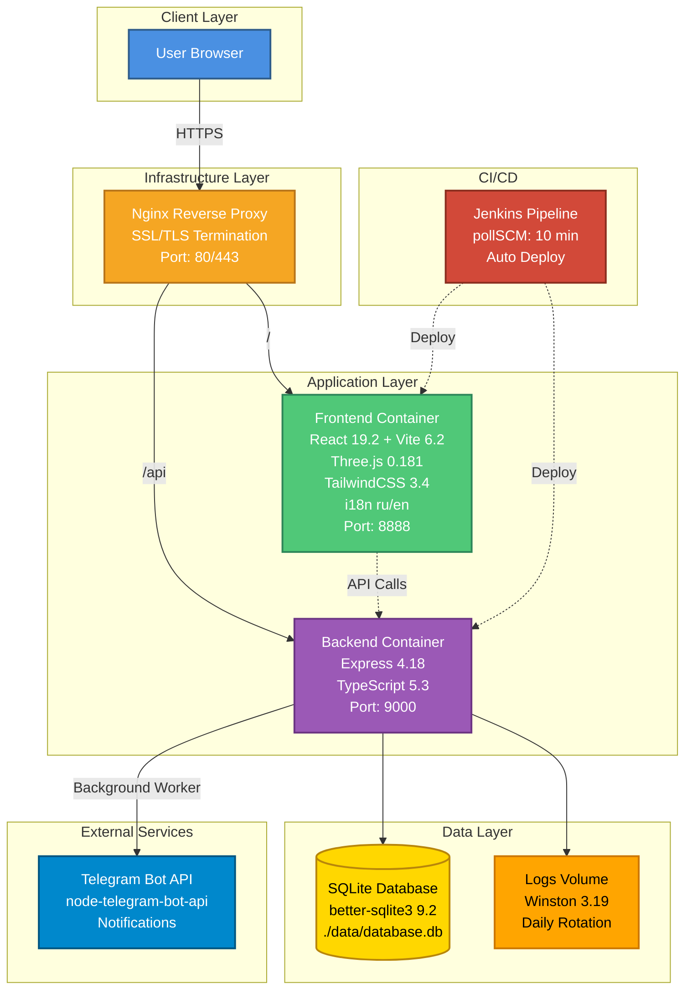

# Personal Portfolio - Aleksandr Zhukov

[](https://www.typescriptlang.org/)
[](https://react.dev/)
[](https://nodejs.org/)
[](https://expressjs.com/)
[](https://www.docker.com/)
[](https://www.jenkins.io/)
[](https://vitejs.dev/)
[](https://threejs.org/)
[](https://tailwindcss.com/)
[](https://www.sqlite.org/)
[](https://vitest.dev/)
[](https://playwright.dev/)

Senior Software Architect portfolio website with full internationalization (i18n), 3D graphics, automated CI/CD pipeline, and comprehensive testing.

## ✨ Features

- 🌍 **Full Internationalization (i18n)**: Russian and English language support with automatic detection
- 🎨 **3D Interactive Background**: Three.js powered solar system visualization
- 📱 **Responsive Design**: Mobile-first approach with modern UI/UX
- 🚀 **CI/CD Pipeline**: Automated deployment via Jenkins with pollSCM (10-minute intervals)
- 🔒 **Security**: Rate limiting, CORS, input sanitization, Helmet.js protection
- 📊 **Real-time Notifications**: Contact form with Telegram bot integration
- 🐳 **Dockerized**: Full containerization with Docker Compose
- ⚡ **Performance**: Optimized builds, code splitting, lazy loading
- 🧪 **Testing**: E2E tests with Playwright, unit tests with Vitest

## 🚀 Quick Start

### Prerequisites

- **Node.js**: v20+
- **npm**: v9+
- **Docker**: v20+ and **Docker Compose** v2+ (for production)
- **Git**: for repository management

### Development Setup

```bash
# Clone repository
git clone https://github.com/FerrPOINT/personal-page.git
cd personal-page

# Setup environment
make local

# Install dependencies
make install

# Run database migrations
make migrate

# Start with Docker (recommended)
make docker-build

# Services available at:
# - Frontend: http://localhost:8888
# - Backend: http://localhost:9000
```

### Local Development

```bash
# Terminal 1: Backend
make dev-backend
# Backend: http://localhost:9000

# Terminal 2: Frontend
make dev-frontend
# Frontend: http://localhost:5173
```

## 📦 Tech Stack

### Frontend

- **React 19.2** - Modern UI library with concurrent features
- **TypeScript 5.8** - Type safety and developer experience
- **Vite 6.2** - Next-generation build tool and dev server
- **Three.js 0.181** - 3D graphics via @react-three/fiber & @react-three/drei
- **Framer Motion 12.23** - Smooth animations and transitions
- **Recharts 3.5** - Data visualization and charts
- **React Hook Form 7.67** - Form management and validation
- **TailwindCSS 3.4** - Utility-first CSS framework
- **PostCSS** - CSS processing
- **Lucide React** - Modern icon library
- **Vitest 4.0** - Unit testing framework
- **Testing Library** - React component testing
- **Playwright 1.58** - E2E testing
- **Nginx** - Production web server

### Backend

- **Node.js 20+** - JavaScript runtime
- **Express 4.18** - Web framework
- **TypeScript 5.3** - Type safety
- **SQLite** - Database via better-sqlite3 9.2
- **Telegram Bot API** - Real-time notifications via node-telegram-bot-api
- **Winston 3.19** - Structured logging
- **winston-daily-rotate-file** - Log rotation
- **Helmet.js 7.1** - Security headers
- **express-rate-limit 7.1** - Rate limiting protection
- **CORS 2.8** - Cross-origin resource sharing
- **UUID 13.0** - Unique identifier generation
- **dotenv 16.3** - Environment variable management
- **tsx 4.7** - TypeScript execution
- **Vitest 4.0** - Testing framework

### DevOps & Infrastructure

- **Docker & Docker Compose** - Containerization
- **Jenkins** - CI/CD automation
- **Nginx** - Reverse proxy and static file serving
- **Git** - Version control
- **Makefile** - Cross-platform build automation

## 🏗️ System Architecture



### Components

- **Frontend**: React SPA with i18n, builds to static files, served via Nginx
- **Backend**: Express API server with REST endpoints
- **Database**: SQLite (file-based DB, persisted in Docker volume)
- **Worker**: Background process for Telegram notifications
- **CI/CD**: Jenkins pipeline with automated deployment (pollSCM every 10 minutes)

## 🔧 Configuration

### Environment Variables

Create `.env` file in project root:

```env
# Database (SQLite)
DATABASE_PATH=./data/database.db

# Telegram Bot (optional - worker won't start without token)
TELEGRAM_BOT_TOKEN=your_bot_token_here
TELEGRAM_USER_ID=your_user_id_here

# Backend API Configuration
API_PORT=9000
NODE_ENV=development
FRONTEND_URL=http://localhost:8888,http://localhost:5173

# Frontend API Configuration
# For local dev: VITE_API_URL=http://localhost:9000/api
# For production: not needed - uses relative path /api
VITE_API_URL=http://localhost:9000/api
```

**Notes:**
- `.env` is in `.gitignore` and not committed to repository
- Copy `env.local` to `.env` (or use `make local`)
- Docker Compose automatically loads variables from root `.env`

## 🏭 CI/CD Pipeline

### Jenkins Configuration

- **Pipeline**: Defined in `Jenkinsfile`
- **Trigger**: `pollSCM` every 10 minutes (checks for changes in main branch)
- **Deployment**: Automated SSH deployment to production server
- **Timezone**: Configured for Asia/Novosibirsk (UTC+7)

### Pipeline Stages

1. **Checkout**: Clone repository
2. **Validate**: Verify Jenkinsfile exists
3. **Deploy**: SSH to server and run deployment script

### Documentation

- **Quick Start**: `info/jenkins/jenkins-quickstart.qmd`
- **Full Guide**: `info/jenkins/pipeline.qmd`
- **Setup Guide**: `info/jenkins/jenkins-cicd-setup-guide.qmd`

## 🔒 Security Features

### Backend Security

- **Rate Limiting**: 5 requests per 15 minutes per IP for contact form
- **CORS Protection**: Configured for specific frontend origins
- **Helmet.js**: Security headers (XSS, clickjacking, MIME-sniffing)
- **Input Sanitization**: HTML tags and control characters removed
- **Request Size Limit**: 1MB body size limit to prevent DoS
- **SQL Injection Protection**: Parameterized queries via better-sqlite3

### Frontend Security

- **Content Security Policy**: Configured via Nginx
- **XSS Protection**: React's built-in escaping
- **HTTPS Ready**: Production-ready SSL/TLS configuration

## 📝 Available Commands

### Makefile Commands

```bash
# Environment Setup
make local              # Copy env.local to .env and setup local dev
make prod               # Copy env.prod to .env for production

# Docker Commands
make docker-up          # Start Docker containers
make docker-down        # Stop Docker containers
make docker-build       # Rebuild and start containers
make docker-logs        # Show all container logs
make docker-logs-backend   # Backend logs only
make docker-logs-frontend  # Frontend logs only
make docker-clean       # Stop and remove containers with volumes

# Local Development
make dev-backend        # Start backend in dev mode
make dev-frontend       # Start frontend in dev mode
make build-backend      # Build backend
make build-frontend     # Build frontend

# Testing
make test               # Run Playwright E2E tests
npm test                # Run Playwright tests
npm run test:ui         # Run tests with UI
npm run test:headed     # Run tests in visible browser

# Utilities
make install            # Install dependencies for both projects
make migrate            # Run database migrations
make clean              # Full cleanup (containers, volumes, images, .env)
make help               # Show command help
```

### NPM Scripts

**Frontend:**
- `npm run dev` - Start development server
- `npm run build` - Build for production
- `npm run preview` - Preview production build
- `npm test` - Run Vitest unit tests

**Backend:**
- `npm run dev` - Start development server with hot reload
- `npm run build` - Build TypeScript
- `npm run start` - Start production server
- `npm run migrate` - Run database migrations
- `npm test` - Run Vitest tests

## 📡 API Documentation

### Health Check

```http
GET /health
```

**Response:**
```json
{
  "status": "ok",
  "service": "personal-page-backend",
  "database": "connected",
  "timestamp": "2025-01-15T10:30:00.000Z"
}
```

### Contact Form

```http
POST /api/contact
Content-Type: application/json
```

**Request Body:**
```json
{
  "name": "John Doe",
  "email": "john@example.com",
  "message": "Hello, I'm interested in your work!"
}
```

**Success Response (200):**
```json
{
  "success": true,
  "message": "Message saved successfully",
  "data": {
    "id": "uuid-here",
    "status": "pending"
  }
}
```

**Error Response (400):**
```json
{
  "success": false,
  "error": "Validation failed",
  "details": [
    "Email is required",
    "Message must be at least 10 characters"
  ]
}
```

**Rate Limiting:**
- 5 requests per IP per 15 minutes
- HTTP 429 on limit exceeded

## 🗄️ Database Schema

### Messages Table

```sql
CREATE TABLE messages (
  id TEXT PRIMARY KEY,
  name TEXT NOT NULL,
  email TEXT NOT NULL,
  message TEXT NOT NULL,
  status TEXT NOT NULL DEFAULT 'pending',
  created_at TEXT NOT NULL DEFAULT CURRENT_TIMESTAMP,
  sent_at TEXT,
  error_message TEXT
);
```

### BotSettings Table

```sql
CREATE TABLE bot_settings (
  id INTEGER PRIMARY KEY AUTOINCREMENT,
  telegram_user_id TEXT,
  telegram_chat_id TEXT,
  updated_at TEXT NOT NULL DEFAULT CURRENT_TIMESTAMP
);
```

**Migrations:**
- Located in `backend/db/migrations/`
- Run: `npm run migrate` (in backend) or `make migrate`
- Executed automatically on first startup

## 🌍 Internationalization (i18n)

The application supports full internationalization with automatic language detection:

### Supported Languages

- **English (en)** - Default language
- **Russian (ru)** - Full translation

### Features

- **Automatic Detection**: Detects browser language via `navigator.language`
- **LocalStorage Persistence**: Saves user language preference
- **Language Switcher**: Manual language toggle in navigation
- **Dynamic Content**: All content (projects, experience, blog posts) is translatable
- **Fallback Support**: Falls back to English if translation key is missing

### Implementation

- **Context-based**: React Context API for language state management
- **Hook-based**: `useLanguage()` hook for easy access
- **Type-safe**: TypeScript support for translation keys
- **Performance**: `useCallback` optimization for translation function

## 🧪 Testing

### E2E Testing (Playwright)

```bash
npm test              # Run all E2E tests
npm run test:ui       # Run tests with UI
npm run test:headed   # Run tests in visible browser
npm run test:debug   # Run tests in debug mode
```

### Unit Testing (Vitest)

```bash
cd frontend && npm test        # Run frontend unit tests
cd backend && npm test         # Run backend unit tests
cd frontend && npm run test:ui # Run tests with UI
```

## 🐛 Troubleshooting

### Backend Won't Start

**Check:**
1. Port 9000 not in use
2. `.env` variables are correct
3. Database created: check `./data/database.db`
4. Dependencies installed: `cd backend && npm install`

**Solution:**
```bash
cd backend
rm -rf node_modules package-lock.json
npm install
npm run migrate
npm run dev
```

### Frontend Can't Connect to Backend

**Check:**
1. Backend running at `http://localhost:9000`
2. `VITE_API_URL=http://localhost:9000/api` in `.env`
3. CORS configured (check `FRONTEND_URL` in backend `.env`)

**Solution:**
```bash
# Test backend
curl http://localhost:9000/health

# Test API
curl -X POST http://localhost:9000/api/contact \
  -H "Content-Type: application/json" \
  -d '{"name":"Test","email":"test@test.com","message":"Test message"}'
```

### Docker Containers Won't Start

**Solution:**
```bash
# Check logs
make docker-logs

# Rebuild from scratch
make docker-clean
make docker-build

# Check ports
docker ps
```

## 📊 Performance

### Optimization Features

- **Code Splitting**: Dynamic imports for large components
- **Lazy Loading**: React.lazy for route-based splitting
- **Image Optimization**: Optimized assets and lazy loading
- **Bundle Size**: Tree shaking and minification
- **Caching**: Browser caching via Nginx headers

### Metrics

- **Initial Load**: < 2s (3G connection)
- **Time to Interactive**: < 3s
- **Bundle Size**: ~2.2MB (gzipped: ~630KB)
- **Lighthouse Score**: 90+ (Performance, Accessibility, Best Practices)

## 🌐 Browser Support

- **Chrome**: Latest 2 versions
- **Firefox**: Latest 2 versions
- **Safari**: Latest 2 versions
- **Edge**: Latest 2 versions
- **Mobile**: iOS Safari 14+, Chrome Mobile 90+

## 📚 Additional Resources

- **Project Documentation**: `info/` directory
- **Deployment Guide**: `info/guides/deployment-guide.qmd`
- **Sprints & Tasks**: `info/sprint1/`
- **Jenkins Documentation**: `info/jenkins/`

## 📄 License

Private project - All rights reserved

## 👤 Author

**Aleksandr Zhukov**
- Senior Software Architect
- Portfolio: [azhukov-dev.ru](https://azhukov-dev.ru)
- Email: ferruspoint@mail.ru

---

**Last Updated**: 2026-02-18  
**Version**: 1.0.0
