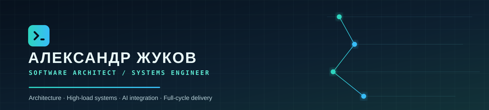
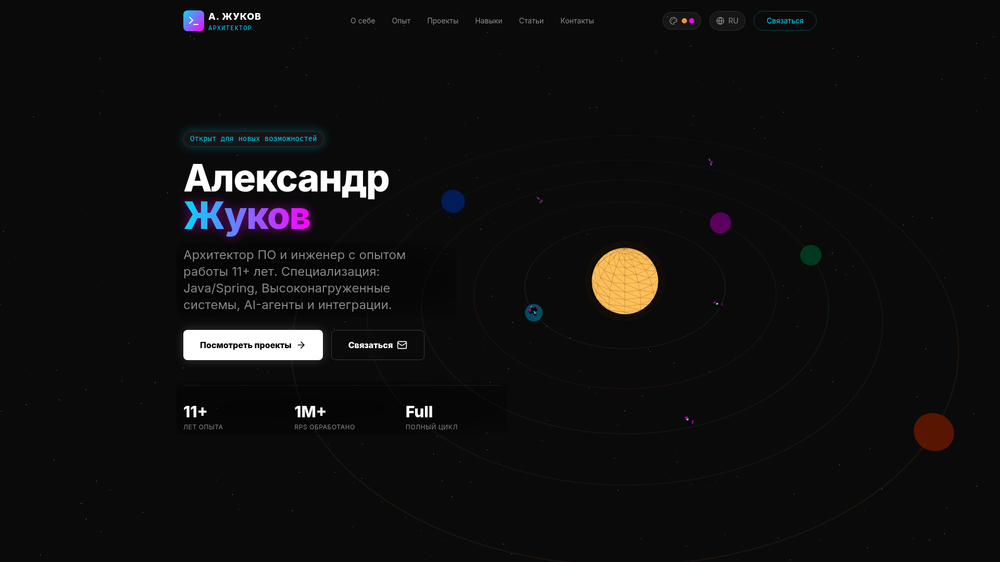
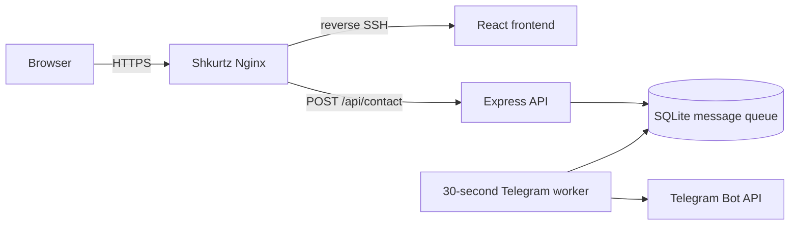

<p align="center">
  
</p>

<p align="center">
  <a href="#overview"></a>
  <a href="#capabilities"></a>
  <a href="#quick-start"></a>
  <a href="#visual-proof"></a>
  <a href="#architecture"></a>
  <a href="#quality"></a>
</p>

<p align="center">
  
  
  
  
  <a href="https://github.com/FerrPOINT/personal-page/actions/workflows/ci.yml"></a>
</p>

> Персональная full-stack страница: React frontend и Node.js backend реализованы на TypeScript, а контактные обращения проходят через Express API в durable SQLite queue. Репозиторий не является частью runtime-каталога Base и не публикует внутренние сервисы платформы.

<a name="overview"></a>
## Обзор

| Область | Реализация |
|---|---|
| Клиент | React 19, TypeScript, Vite, Tailwind CSS, Three.js |
| API | Node.js 24, Express, TypeScript |
| Приём обращений | `POST /api/contact` с durable SQLite queue |
| Доставка | фоновый Telegram worker с ограниченными retry |
| Локальные порты | frontend `8888`, backend `9000` |
| Развёртывание | Docker Compose, образы с commit SHA, loopback listeners |
| Лицензия | `ISC` в root `package.json`; отдельный root license text пока не отслеживается |

Контент портфолио хранится в Git: проекты, опыт, навыки и metadata находятся в `frontend/src/content`, а длинные статьи загружаются только при открытии материала. Контактная форма сначала сохраняет принятую заявку в SQLite и только затем возвращает `202 Accepted`; доступность Telegram не меняет этот ответ.

<a name="capabilities"></a>
## Возможности

| Поверхность | Текущее проверяемое поведение |
|---|---|
| Главная страница | hero с 3D-сценой, навигация по якорным разделам, RU/EN и выбор палитры |
| Опыт и проекты | timeline, фильтрация проектных кейсов, галерея и модальное подробное описание |
| Инсайты | language-specific Markdown-статьи, подгружаемые при открытии |
| Контакт | валидация имени, email и сообщения; rate-limited `POST /api/contact` |
| Доставка | очередь сообщений, lease recovery, retry после 1, 5, 15, 60, 360, 720 и 1440 минут; после восьмой неудачи запись становится `dead` и требует явного replay |

<a name="quick-start"></a>
## Быстрый старт

Для локальной разработки нужны Node.js 24 и npm. Значения из `.env` не коммитятся; без Telegram-конфигурации backend можно собрать и протестировать, но `/ready` не будет готов для production delivery.

```bash
git clone git@github.com:FerrPOINT/personal-page.git
cd personal-page
make install
make typecheck
make test
make build

# frontend development server: http://127.0.0.1:8888
cd frontend && npm run dev -- --host 127.0.0.1
```

Для production-equivalent Compose-проверки:

```bash
make compose-config
```

Compose публикует frontend и backend только на loopback. Полная процедура сборки, передачи образов, migration, smoke, readback и rollback описана в [deploy/README.md](deploy/README.md).

<a name="visual-proof"></a>
## Визуальное доказательство

### Главная страница



Снимок сделан с локальной фактической Vite-сборки в desktop viewport `1920x1080`; hero, якорная навигация, 3D-сцена и CTA отрендерены без console errors. В README намеренно нет mobile или auth-кадров.

<a name="architecture"></a>
## Архитектура


```mermaid
flowchart LR
    Browser[Browser] -->|HTTPS| Edge[Shkurtz Nginx]
    Edge -->|reverse SSH| Frontend[React frontend]
    Edge -->|POST /api/contact| Backend[Express API]
    Backend --> Queue[(SQLite message queue)]
    Worker[30-second Telegram worker] --> Queue
    Worker --> Telegram[Telegram Bot API]
```

| Граница | Правило |
|---|---|
| Public edge | Публикует сайт и только `POST /api/contact`; остальные `/api/*`, `/live` и `/ready` на edge возвращают `404` |
| Backend | Принимает JSON до 64 KiB, валидирует данные и сохраняет сообщение до ответа `202` |
| Delivery | Worker leases одну due-запись, восстанавливает устаревшие leases и не удаляет сообщения автоматически |
| Secrets | Telegram token, chat ID и runtime env живут вне Git; в репозиторий попадает только `.env.example` |

<a name="interfaces"></a>
## Контракты и операции

### `POST /api/contact`

Успешное durable принятие возвращает `202`:

```json
{
  "success": true,
  "data": {
    "id": "uuid",
    "status": "pending"
  }
}
```

Ошибки используют единый JSON shape с `requestId`; ожидаемые статусы: `400`, `409`, `413`, `429` и `500`. Внутренние `GET /live` и `GET /ready` существуют только на backend loopback. Для очереди доступны `npm run queue:list` и `npm run message:replay -- <message-id>` из `backend`.

<a name="quality"></a>
## Качество и проверки

| Проверка | Команда |
|---|---|
| README contract | `python3 scripts/verify_readme.py` |
| README validator tests | `python3 -m unittest scripts.tests.test_verify_readme` |
| Frontend typecheck/tests/build | `cd frontend && npm run typecheck && npm run test:run && npm run build` |
| Backend typecheck/tests/build | `cd backend && npm run typecheck && npm test -- --run && npm run build` |
| Полный локальный gate | `make check` |
| E2E inventory | `npm test -- --list` |
| Compose contract | `make compose-config` |

CI запускает docs, frontend и backend gates на push и pull request. E2E-сценарии остаются локальной проверкой против запущенной страницы на `8888`.

## Документы

- [deploy/README.md](deploy/README.md) — production release, smoke, queue operations и rollback.
- [frontend/src/content/README.md](frontend/src/content/README.md) — source of truth для portfolio content и local project media.
- [.env.example](.env.example) — только безопасные имена runtime-переменных.
- [SECURITY.md](SECURITY.md) — приватный порядок сообщения об уязвимостях.
- [CONTRIBUTING.md](CONTRIBUTING.md) — setup и contribution gates.

<a name="license"></a>
## Лицензия

Репозиторий сейчас декларирует `ISC` в root `package.json`; отдельный source-controlled license text отсутствует. Перед внешним распространением необходимо добавить согласованный LICENSE и синхронизировать package metadata.