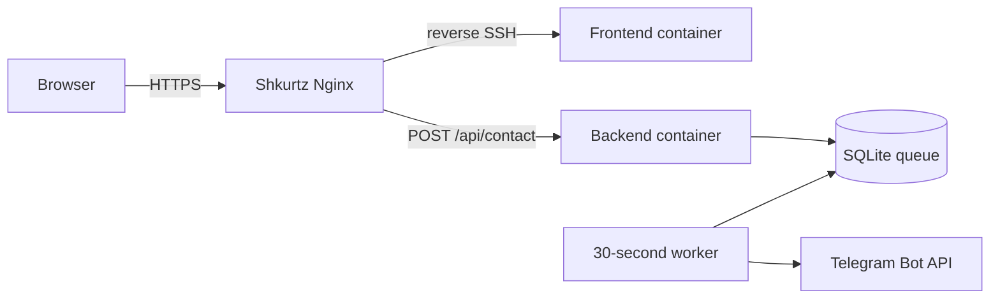

# Personal Page — Aleksandr Zhukov

Portfolio site with a React frontend and a small Node.js backend for the contact form.

## Architecture


```mermaid
flowchart LR
    Browser -->|HTTPS| Edge[Shkurtz Nginx]
    Edge -->|reverse SSH| Frontend[Frontend container]
    Edge -->|POST /api/contact| Backend[Backend container]
    Backend --> SQLite[(SQLite queue)]
    Worker[30-second worker] --> SQLite
    Worker --> Telegram[Telegram Bot API]
```

The API writes each accepted message to SQLite before returning `202 Accepted`. A single worker leases queued rows and retries Telegram delivery after 1, 5, 15, 60, 360, 720 and 1440 minutes. The eighth failed attempt becomes `dead` and requires an explicit replay.

## Requirements

- Node.js 24 LTS
- Docker with Compose for the production-equivalent stack

## Configuration

Copy `.env.example` to `.env` and provide runtime values. Never commit `.env`.

Required in production:

- `TELEGRAM_BOT_TOKEN`
- `TELEGRAM_CHAT_ID`
- `FRONTEND_URL`
- `IMAGE_TAG` when Compose is used

Gmail and SMTP are not used.

## Local development

```bash
cd backend
npm ci
npm run migrate
npm run dev

cd ../frontend
npm ci
npm run dev
```

The frontend runs at `http://localhost:8888` and proxies `/api` to the backend at `http://localhost:9000`.

## Checks

```bash
cd backend
npm run build
npm test
npm audit --omit=dev

cd ../frontend
npm run build
npm run test:run
npm audit --omit=dev

cd ..
IMAGE_TAG=local docker compose config
```

## API

### `POST /api/contact`

Maximum message length: 5000 characters.

Successful durable acceptance:

```json
{
  "success": true,
  "data": {
    "id": "uuid",
    "status": "pending"
  }
}
```

The response status is `202`. Telegram availability does not change this response.

Errors have one shape:

```json
{
  "success": false,
  "error": {
    "code": "VALIDATION_ERROR",
    "message": "Проверьте заполненные поля",
    "fields": {
      "email": "Некорректный email"
    }
  },
  "requestId": "uuid"
}
```

Expected statuses: `400`, `409`, `413`, `429`, and `500`.

### Internal health

- `GET /live` checks the process.
- `GET /ready` checks the SQLite schema and Telegram configuration.

The public Nginx configuration returns `404` for both endpoints and for every API route except `POST /api/contact`.

## Queue operations

Inspect recent rows locally:

```bash
sqlite3 data/database.db "SELECT id,status,attempt_count,next_attempt_at,created_at FROM messages ORDER BY created_at DESC LIMIT 20;"
```

Replay one `dead` row:

```bash
cd backend
npm run message:replay -- <message-id>
```

Messages are retained indefinitely. There is no automatic message cleanup.

## Production release

Production uses a manual, commit-tagged image transfer to Firebat1. Images are not built on Firebat1. The complete build, migration, smoke, readback and rollback procedure is in [deploy/README.md](deploy/README.md).
